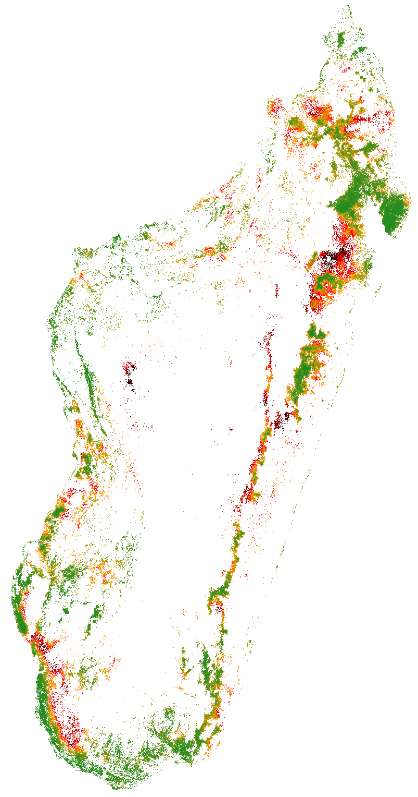

# deforestprob Python package

## Estimating deforestation probability in the tropics

`deforestprob` is a Python package to estimate the spatial probability
of deforestation in the tropics depending on various spatial
environmental variables.

Spatial environmental variables can be derived from topography
(altitude, slope, and aspect), accessibility (distance to roads,
towns, and forest edge), deforestation history (distance to previous
deforestation) or landscape policy (location inside a protected area)
for example.

Function `.sample()` allows the random sampling of observations points
considering historical deforestation maps. The sampling is balanced
and stratified considering remaining forest and deforested areas after
a given time period. The function also retrieves information from
environmental variables for each sampled point. The sampling is done
by block to allow the computation on large study areas (e.g. country
or continental scale) with a fine spatial resolution (e.g. 30m).

Function `.model()` can be used to estimate the parameters of a
deforestation model. Two algorithms are available: Random Forest and
hSDM\_binomial\_iCAR:

* Random Forest (Breiman 2001) uses an ensemble modelling of random
classification trees to estimate the deforestation probability of a
pixel given the environmental variables. The model using Random Forest
includes X and Y coordinates to account for the spatial
autocorrelation of the observations (Mascaro et al. 2014). The
`.model()` function calls the `RandomForestClassifier()` function from
the external `sklearn.ensemble` module.

* hSDM\_binomial\_iCAR (Vieilledent et al. 2014) uses a linear Binomial
logistic regression model to estimate the deforestation probability of
a pixel given the environmental variables. The model includes an
intrinsic Conditional Autoregressive (iCAR) process to account for the
spatial autocorrelation of the observations. Parameter inference is
done in a hierarchical Bayesian framework. The `.model()` function
calls the `binomial_iCAR()` function from the internal `hSDM`
module. The `binomial_iCAR()` function includes a Gibbs sampler with
a Metropolis algorithm written in pure C code to reduce computation
time.

Function `.predict()` allows predicting the deforestation probability
on the whole study area using the deforestation model fitted with the
`.model()` function. The prediction is done by block to allow the
computation on large study areas (e.g. country or continental scale)
with a fine spatial resolution (e.g. 30m).

## References

**Breiman L.** 2001. Random Forests. _Machine Learning_. 45: 5-32.
doi: [10.1023/A:1010933404324](http://dx.doi.org/10.1023/A:1010933404324)

**Mascaro J., G. P. Asner, D. E. Knapp, T. Kennedy-Bowdoin,
R. E. Martin, C. Anderson, M. Higgins and K. D. Chadwick.** 2014. A
tale of two "forests": Random Forest machine learning aids tropical
forest carbon mapping. _PLoS One_. 9(1): e85993.
doi: [10.1371%2Fjournal.pone.0085993](http://dx.doi.org/10.1371%2Fjournal.pone.0085993)

**Vieilledent G., C. Merow, J. Guélat, A. M. Latimer, M. Kéry,
A. E. Gelfand, A. M. Wilson, F. Mortier and J. A. Silander
Jr.** 2014. hSDM CRAN release v1.4 for hierarchical Bayesian species
distribution models. _Zenodo_.
doi: [10.5281/zenodo.48470](http://doi.org/10.5281/zenodo.48470)

## Installation

The easiest way to install the `deforestprob` Python module is via [pip](https://pip.pypa.io/en/stable/):

```
~$ sudo pip install --upgrade https://github.com/ghislainv/deforestprob/archive/master.zip
```

but you can also install it executing the `setup.py` file:

```
~$ git clone https://github.com/ghislainv/deforestprob
~$ cd deforestprob
~/deforestprob$ sudo python setup.py install
```

## Figure

Map of the probability of deforestation in Madagascar for the year
2010 obtained with deforestprob. Dark red: high probability of
deforestation, Dark green: low probability of deforestation.



