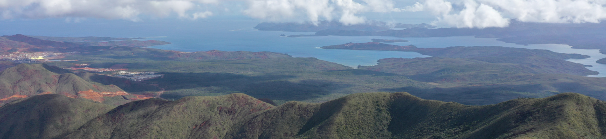
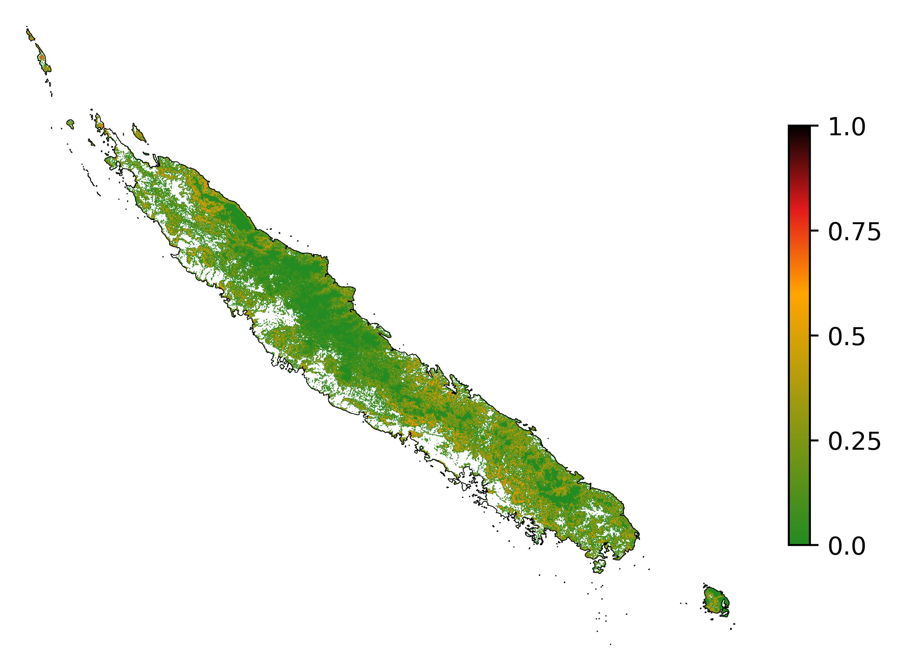

=============
New Caledonia
=============

Introduction
------------

This notebook presents the approach used to model and forecast
deforestation in New Caledonia.

The approach is based on a methodology described in the following
article:

**Vieilledent G., C. Vancutsem, and F. Achard.** Forest refuge areas and
carbon emissions from tropical deforestation in the 21\ :sup:`st`\ century.

More information on the method can be find at the ForestAtRisk
website: `https://forestatrisk.cirad.fr <https://forestatrisk.cirad.fr>`_.

Importing Python modules
~~~~~~~~~~~~~~~~~~~~~~~~

We import the Python modules needed for running the analysis.

.. code:: python

    # Imports
    import os
    import pkg_resources
    import re
    from shutil import copy2
    import sys

    from dotenv import load_dotenv
    import ee
    import numpy as np
    import matplotlib.pyplot as plt
    import pandas as pd
    from patsy import dmatrices
    import pickle
    from sklearn.linear_model import LogisticRegression
    from sklearn.ensemble import RandomForestClassifier
    from sklearn.metrics import log_loss
    from tabulate import tabulate

    from pywdpa import get_token
    import forestatrisk as far

::

    # forestatrisk: modelling and forecasting deforestation in the tropics.
    # https://ecology.ghislainv.fr/forestatrisk/

We create some directories to hold the data and the ouputs with the
function ``far.make_dir()``.

.. code:: python

    far.make_dir("data_raw")
    far.make_dir("data")
    far.make_dir("output")

We increase the cache for GDAL to increase computational speed.

.. code:: python

    # GDAL
    os.environ["GDAL_CACHEMAX"] = "1024"

Set credentials
~~~~~~~~~~~~~~~

We need to configure and set credentials for:

- Google Earth Engine (GEE) API

- RClone to access Google Drive

- WDPA API

You will need a `Google account <https://www.google.com/account/about/>`_ for using the GEE API and accessing
Google Drive.

Access to Google Earth Engine API
^^^^^^^^^^^^^^^^^^^^^^^^^^^^^^^^^

Google Earth Engine is used to compute the past forest cover change
from Vancutsem et al. 2021 or Hansen et al. 2013. To get credentials
for using the Google Earth Engine API, follow these
`instructions <https://developers.google.com/earth-engine/guides/python_install-conda#get_credentials>`_. While authentication with ``ee.Authenticate()`` should be
necessary only once, you have to execute the command ``ee.Initialize()``
at each session.

.. code:: python

    # Uncomment to authenticate for the first time.
    # ee.Authenticate()
    ee.Initialize()

Under Linux and Mac, credentials are stored in
``$HOME/.config/earthengine/credentials``.

.. code:: shell

    cat $HOME/.config/earthengine/credentials

Access to Google Drive with RClone
^^^^^^^^^^^^^^^^^^^^^^^^^^^^^^^^^^

RClone is used to download the forest cover change raster locally from
Google Drive. To install RClone, follow these `instructions for
RClone <https://rclone.org/install/>`_. To configure the access to your Google Drive, follow these
`instructions for accessing Google Drive <https://rclone.org/drive/>`_.

Access to WDPA API
^^^^^^^^^^^^^^^^^^

We will be using the `pywda <https://ecology.ghislainv.fr/pywdpa/>`_ Python package to collect the data on
protected areas from the World Database on Protected Areas (WDPA) at
`https://www.protectedplanet.net <https://www.protectedplanet.net>`_. To access the Protected Planet API,
you must first obtain a Personal API Token by filling in the form
available at `https://api.protectedplanet.net/request <https://api.protectedplanet.net/request>`_. Then you need to
set an environment variable (we recommend using the name ``WDPA_KEY``)
using either the command ``os.environ["WDPA_KEY"]="your_token"`` or
`python-dotenv <https://github.com/theskumar/python-dotenv>`_.

The validity of your token can be checked with the function
``pywdpa.get_token()``.

.. code:: python

    # WDPA API
    load_dotenv(".env")
    get_token()

If your token is valid, the function will return its value. Otherwise
it will print an error message.

Data
----

Compute forest cover change
~~~~~~~~~~~~~~~~~~~~~~~~~~~

We specify the `iso3 <https://fr.wikipedia.org/wiki/ISO_3166-1#Table_de_codage>`_ code of New Caledonia which is “NCL”. 

.. code:: python

    iso3 = "NCL"

We compute the past forest cover change from Vancutsem et al. 2021
using Google Earth Engine. The argument ``gdrive_remote_rclone`` of the
function `far.data.country\_forest\_run() <https://ecology.ghislainv.fr/forestatrisk/subpackages/forestatrisk.build_data.html#forestatrisk.build_data.data.country_forest_run>`_ specifies the name of the
Google Drive remote for rclone. The argument ``gdrive_folder`` specifies
the name of the Google Drive folder to use.

.. code:: python

    # Compute gee forest data
    far.data.country_forest_run(
        iso3, proj="EPSG:4326",
        output_dir="data_raw",
        keep_dir=True,
        fcc_source="jrc", perc=50,
        gdrive_remote_rclone="gdrive_gv",
        gdrive_folder="GEE-forestatrisk-notebooks")

Download raw data
~~~~~~~~~~~~~~~~~

.. code:: python

    # Download data
    far.data.country_download(
        iso3,
        gdrive_remote_rclone="gdrive_gv",
        gdrive_folder="GEE-forestatrisk-notebooks",
        output_dir="data_raw")   

::

    Downloading data for country NCL

Compute explanatory variables
~~~~~~~~~~~~~~~~~~~~~~~~~~~~~

We first set the projection for New-Caledonia which is RGNC91-93 /
Lambert New Caledonia (`EPSG:3163 <https://epsg.io/3163>`_).

.. code:: python

    # Projection
    proj = "EPSG:3163"

We compute the explanatory variables from the raw data.

.. code:: python

    # Compute variables
    far.data.country_compute(
        iso3,
        temp_dir="data_raw",
        output_dir="data",
        proj=proj,
        data_country=True,
        data_forest=True,
        keep_temp_dir=True)

Adding data on ultramafic soils
~~~~~~~~~~~~~~~~~~~~~~~~~~~~~~~

Data can be downloaded from `Géorep <https://georep-dtsi-sgt.opendata.arcgis.com/datasets/40d5b1a5afa244b1a73dd3620df075de_0/explore?location=-21.087852%2C165.489950%2C8.00>`_. We unzip the shapefile in the
folder ``gisdata/vectors/peridotite/``, reproject, and rasterize the
data at 30m.

.. code:: shell

    proj="EPSG:3163"
    f1="gisdata/vectors/peridotite/2de32d40-dc86-4bd9-9b83-420699bc672e2020413-1-13dmpoq.2hll.shp"
    f2="gisdata/vectors/peridotite/geol_PROJ.shp"
    ogr2ogr -overwrite -s_srs EPSG:4326 -t_srs $proj -f 'ESRI Shapefile' \
            -lco ENCODING=UTF-8 $f2 $f1

We rasterize the polygon file using value 1 when on ultramafic soils
and 0 when not. Extent is obtained from file ``pa.tif`` with command
``gdalinfo``.

.. code:: shell

    gdalinfo data/pa.tif

::

    Driver: GTiff/GeoTIFF
    Files: data/pa.tif
    Size is 14296, 12541
    Coordinate System is:
    PROJCRS["RGNC91-93 / Lambert New Caledonia",
        BASEGEOGCRS["RGNC91-93",
            DATUM["Reseau Geodesique de Nouvelle Caledonie 91-93",
                ELLIPSOID["GRS 1980",6378137,298.257222101,
                    LENGTHUNIT["metre",1]]],
            PRIMEM["Greenwich",0,
                ANGLEUNIT["degree",0.0174532925199433]],
            ID["EPSG",4749]],
        CONVERSION["Lambert New Caledonia",
            METHOD["Lambert Conic Conformal (2SP)",
                ID["EPSG",9802]],
            PARAMETER["Latitude of false origin",-21.5,
                ANGLEUNIT["degree",0.0174532925199433],
                ID["EPSG",8821]],
            PARAMETER["Longitude of false origin",166,
                ANGLEUNIT["degree",0.0174532925199433],
                ID["EPSG",8822]],
            PARAMETER["Latitude of 1st standard parallel",-20.6666666666667,
                ANGLEUNIT["degree",0.0174532925199433],
                ID["EPSG",8823]],
            PARAMETER["Latitude of 2nd standard parallel",-22.3333333333333,
                ANGLEUNIT["degree",0.0174532925199433],
                ID["EPSG",8824]],
            PARAMETER["Easting at false origin",400000,
                LENGTHUNIT["metre",1],
                ID["EPSG",8826]],
            PARAMETER["Northing at false origin",300000,
                LENGTHUNIT["metre",1],
                ID["EPSG",8827]]],
        CS[Cartesian,2],
            AXIS["easting (X)",east,
                ORDER[1],
                LENGTHUNIT["metre",1]],
            AXIS["northing (Y)",north,
                ORDER[2],
                LENGTHUNIT["metre",1]],
        USAGE[
            SCOPE["Engineering survey, topographic mapping."],
            AREA["New Caledonia - Belep, Grande Terre, Ile des Pins, Loyalty Islands (Lifou, Mare, Ouvea)."],
            BBOX[-22.73,163.54,-19.5,168.19]],
        ID["EPSG",3163]]
    Data axis to CRS axis mapping: 1,2
    Origin = (139830.000000000000000,521700.000000000000000)
    Pixel Size = (30.000000000000000,-30.000000000000000)
    Metadata:
      AREA_OR_POINT=Area
    Image Structure Metadata:
      COMPRESSION=LZW
      INTERLEAVE=BAND
    Corner Coordinates:
    Upper Left  (  139830.000,  521700.000) (163d31'22.97"E, 19d28'44.64"S)
    Lower Left  (  139830.000,  145470.000) (163d27'53.88"E, 22d52'35.34"S)
    Upper Right (  568710.000,  521700.000) (167d36'22.62"E, 19d29'23.46"S)
    Lower Right (  568710.000,  145470.000) (167d38'38.23"E, 22d53'15.07"S)
    Center      (  354270.000,  333585.000) (165d33'34.36"E, 21d11'45.81"S)
    Band 1 Block=14296x1 Type=Byte, ColorInterp=Gray
      NoData Value=255

.. code:: shell

    proj="EPSG:3163"
    f2="gisdata/vectors/peridotite/geol_PROJ.shp"
    f3="data/geol.tif"
    gdal_rasterize -te 139830 145470 568710 521700 -tap -burn 1 \
                   -co "COMPRESS=LZW" -co "PREDICTOR=2" -co "BIGTIFF=YES" \
    	       -init 0 \
                   -a_nodata 255 -a_srs "$proj" \
    	       -ot Byte -tr 30 30 -l geol_PROJ $f2 $f3

Files
~~~~~

The ``data`` folder includes:

- Forest cover change data for the period 2010-2020 as a GeoTiff raster
  file (``data/fcc23.tif``).

- Spatial explanatory variables as GeoTiff raster files (``.tif``
  extension, eg. ``data/dist_edge.tif`` for distance to forest edge).

- Additional folders: ``forest``, ``forecast``, and ``emissions``, with forest
  cover change for different periods of time, explanatory variables at
  different dates used for projections in the future, and forest carbon
  data for computing carbon emissions.

.. code:: python

    # Plot forest
    fig_fcc23 = far.plot.fcc(
        input_fcc_raster="data/fcc23.tif",
        maxpixels=1e8,
        output_file="output/fcc23.png",
        borders="data/ctry_PROJ.shp",
        linewidth=0.3, dpi=500)

::

    Build overview

Variable characteristics are summarized in the following table:

.. table::

    +------------------------------+-----------------------+--------------------------------+--------+----------------+
    | Product                      | Source                | Variable                       | Unit   | Resolution (m) |
    +==============================+=======================+================================+========+================+
    | Forest maps (2000-2010-2020) | Vancutsem et al. 2021 | distance to forest edge        | m      |             30 |
    +------------------------------+-----------------------+--------------------------------+--------+----------------+
    | \                            | \                     | distance to past deforestation | m      |             30 |
    +------------------------------+-----------------------+--------------------------------+--------+----------------+
    | Digital Elevation Model      | SRTM v4.1 CSI-CGIAR   | altitude                       | m      |             90 |
    +------------------------------+-----------------------+--------------------------------+--------+----------------+
    | \                            | \                     | slope                          | degree |             90 |
    +------------------------------+-----------------------+--------------------------------+--------+----------------+
    | Highways                     | OSM-Geofabrik         | distance to roads              | m      |            150 |
    +------------------------------+-----------------------+--------------------------------+--------+----------------+
    | Places                       | \                     | distance to towns              | m      |            150 |
    +------------------------------+-----------------------+--------------------------------+--------+----------------+
    | Waterways                    | \                     | distance to river              | m      |            150 |
    +------------------------------+-----------------------+--------------------------------+--------+----------------+
    | Protected areas              | WDPA                  | protected area presence        | --     |             30 |
    +------------------------------+-----------------------+--------------------------------+--------+----------------+
    | Geology                      | Géorep 1/50.000       | peridotite bed presence        | --     |             30 |
    +------------------------------+-----------------------+--------------------------------+--------+----------------+

Sampling
--------

Sampling the observations
~~~~~~~~~~~~~~~~~~~~~~~~~

.. code:: python

    # Sample points
    dataset = far.sample(nsamp=10000, adapt=True, seed=1234, csize=10,
                         var_dir="data",
                         input_forest_raster="fcc23.tif",
                         output_file="output/sample.txt",
                         blk_rows=0)
    # Import data as pandas DataFrame if necessary
    # dataset = pd.read_table("output/sample.txt", delimiter=",")

.. code:: python

    # Remove NA from data-set (otherwise scale() and
    # model_binomial_iCAR doesn't work)
    dataset = dataset.dropna(axis=0)
    # Set number of trials to one for far.model_binomial_iCAR()
    dataset["trial"] = 1
    # Print the first five rows
    print(dataset.head(5))

::

    altitude  dist_defor  dist_edge  dist_river  dist_road  dist_town  fcc23  geol   pa  slope         X         Y  cell  trial
    1      56.0       120.0       30.0     91747.0    19945.0    19860.0    0.0   1.0  1.0   10.0  145545.0  514875.0   0.0      1
    2      35.0       162.0       30.0     89177.0    17328.0    17242.0    0.0   1.0  1.0    4.0  146595.0  512475.0   0.0      1
    3      70.0       509.0       42.0     88256.0    16508.0    16417.0    0.0   1.0  1.0   11.0  147315.0  511875.0   0.0      1
    4      74.0       488.0       60.0     90900.0    18870.0    18795.0    0.0   1.0  0.0   15.0  145095.0  513525.0   0.0      1
    5      66.0       210.0       67.0     89386.0    17522.0    17437.0    0.0   1.0  1.0   13.0  146445.0  512685.0   0.0      1

.. code:: python

    # Sample size
    ndefor = sum(dataset.fcc23 == 0)
    nfor = sum(dataset.fcc23 == 1)
    with open("output/sample_size.csv", "w") as f:
        f.write("var, n\n")
        f.write("ndefor, " + str(ndefor) + "\n")
        f.write("nfor, " + str(nfor) + "\n")
    print("ndefor = {}, nfor = {}".format(ndefor, nfor))

::

    ndefor = 9933, nfor = 9977

Correlation plots
~~~~~~~~~~~~~~~~~

.. code:: python

    # Correlation formula
    formula_corr = "fcc23 ~ dist_road + dist_town + dist_river + \
    dist_defor + dist_edge + altitude + slope - 1"

    # Output file
    of = "output/correlation.pdf"
    # Data
    y, data = dmatrices(formula_corr, data=dataset,
                        return_type="dataframe")
    # Plots
    figs = far.plot.correlation(
        y=y, data=data,
        plots_per_page=3,
        figsize=(7, 8),
        dpi=80,
        output_file=of)

Model
-----

Model preparation
~~~~~~~~~~~~~~~~~

.. code:: python

    # Neighborhood for spatial-autocorrelation
    nneigh, adj = far.cellneigh(raster="data/fcc23.tif", csize=10, rank=1)

    # List of variables
    variables = ["C(pa)", "C(geol)", "scale(altitude)", "scale(slope)",
                 "scale(dist_defor)", "scale(dist_edge)", "scale(dist_road)",
                 "scale(dist_town)", "scale(dist_river)"]
    # Transform into numpy array
    variables = np.array(variables)

    # Starting values
    beta_start = -99  # Simple GLM estimates
    # Priors
    priorVrho = -1  # -1="1/Gamma"

Variable selection
~~~~~~~~~~~~~~~~~~

.. code:: python

    # Formula
    right_part = " + ".join(variables) + " + cell"
    left_part = "I(1-fcc23) + trial ~ "
    formula = left_part + right_part
    # Model
    mod_binomial_iCAR = far.model_binomial_iCAR(
      # Observations
      suitability_formula=formula, data=dataset,
      # Spatial structure
      n_neighbors=nneigh, neighbors=adj,
      # Priors
      priorVrho=priorVrho,
      # Chains
      burnin=1000, mcmc=1000, thin=1,
      # Starting values
      beta_start=beta_start)

We check the parameter values.

.. code:: python

    mod_binomial_iCAR

::

    Binomial logistic regression with iCAR process
      Model: I(1 - fcc23) + trial ~ 1 + C(pa) + C(geol) + scale(altitude) + scale(slope) + scale(dist_defor) + scale(dist_edge) + scale(dist_road) + scale(dist_town) + scale(dist_river) + cell
      Posteriors:
                            Mean        Std     CI_low    CI_high
            Intercept      -1.88      0.117      -2.13      -1.65
         C(pa)[T.1.0]     0.0479     0.0814     -0.111      0.212
       C(geol)[T.1.0]      0.358     0.0683      0.222      0.484
      scale(altitude)     -0.253     0.0301     -0.316     -0.196
         scale(slope)     -0.114     0.0258     -0.164     -0.065
    scale(dist_defor)     -0.827     0.0433      -0.92     -0.745
     scale(dist_edge)      -6.03      0.216      -6.46      -5.63
     scale(dist_road)     -0.111     0.0402     -0.183    -0.0193
     scale(dist_town)     -0.121     0.0281      -0.18    -0.0713
    scale(dist_river)    -0.0556      0.129     -0.298       0.16
                 Vrho       2.92      0.315       2.34       3.59
             Deviance   1.61e+04       22.1   1.61e+04   1.62e+04

Final model
~~~~~~~~~~~

We remove the protected areas and the distance to river from the list
of explanatory variables as their effects seem not to be significant.

.. code:: python

    # Formula
    variables = ["C(geol)", "scale(altitude)", "scale(slope)",
                 "scale(dist_defor)", "scale(dist_edge)", "scale(dist_road)",
                 "scale(dist_town)"]
    right_part = " + ".join(variables) + " + cell"
    left_part = "I(1-fcc23) + trial ~ "
    formula = left_part + right_part
    # Re-run the model with longer MCMC and estimated initial values
    mod_binomial_iCAR = far.model_binomial_iCAR(
      # Observations
      suitability_formula=formula, data=dataset,
      # Spatial structure
      n_neighbors=nneigh, neighbors=adj,
      # Priors
      priorVrho=priorVrho,
      # Chains
      burnin=5000, mcmc=5000, thin=5,
      # Starting values
      beta_start=mod_binomial_iCAR.betas)

We can plot the traces of the MCMCs.

.. code:: python

    # Plot
    figs = mod_binomial_iCAR.plot(
      output_file="output/mcmc.pdf",plots_per_page=3,
      figsize=(10, 6),
      dpi=80)

We save the model using pickle.

.. code:: python

    # Save model's main specifications with pickle
    mod_icar_pickle = {
      "formula": mod_binomial_iCAR.suitability_formula,
      "rho": mod_binomial_iCAR.rho,
      "betas": mod_binomial_iCAR.betas,
      "Vrho": mod_binomial_iCAR.Vrho,
      "deviance": mod_binomial_iCAR.deviance}
    with open("output/mod_icar.pickle", "wb") as pickle_file:
      pickle.dump(mod_icar_pickle, pickle_file)

We get model’s predictions.

.. code:: python

    # Predictions
    pred_icar = mod_binomial_iCAR.theta_pred

Model comparison and validation
-------------------------------

Cross-validation
~~~~~~~~~~~~~~~~

.. code:: python

    # Cross-validation for icar, glm and RF
    CV_df_icar = far.cross_validation(
      dataset, formula, mod_type="icar", ratio=30, nrep=5,
      icar_args={"n_neighbors": nneigh, "neighbors": adj,
    	     "burnin": 1000, "mcmc": 1000, "thin": 1,
    	     "beta_start": mod_binomial_iCAR.betas})

    CV_df_glm = far.cross_validation(dataset, formula, mod_type="glm", ratio=30, nrep=5)

    CV_df_rf = far.cross_validation(dataset, formula, mod_type="rf", ratio=30, nrep=5,
    			      rf_args={"n_estimators": 500, "n_jobs": 3})

    # Save result to disk
    CV_df_icar.to_csv("output/CV_icar.csv", header=True, index=False)
    CV_df_glm.to_csv("output/CV_glm.csv", header=True, index=False)
    CV_df_rf.to_csv("output/CV_rf.csv", header=True, index=False)

.. code:: python

    print(CV_df_icar)

::

    index    rep1    rep2    rep3    rep4    rep5    mean
    0   AUC  0.8817  0.8854  0.8856  0.8916  0.8901  0.8869
    1    OA  0.8024  0.8048  0.8041  0.8135  0.8091  0.8068
    2    EA  0.5000  0.5001  0.5000  0.5001  0.5000  0.5001
    3   FOM  0.6701  0.6689  0.6732  0.6895  0.6808  0.6765
    4   Sen  0.8025  0.8016  0.8047  0.8162  0.8101  0.8070
    5   Spe  0.8024  0.8078  0.8036  0.8107  0.8082  0.8065
    6   TSS  0.6049  0.6095  0.6082  0.6269  0.6183  0.6136
    7     K  0.6049  0.6095  0.6082  0.6269  0.6183  0.6136

.. code:: python

    print(CV_df_glm)

::

    index    rep1    rep2    rep3    rep4    rep5    mean
    0   AUC  0.8512  0.8584  0.8524  0.8612  0.8582  0.8563
    1    OA  0.7706  0.7783  0.7683  0.7787  0.7757  0.7743
    2    EA  0.5000  0.5001  0.5000  0.5001  0.5000  0.5001
    3   FOM  0.6269  0.6323  0.6246  0.6419  0.6350  0.6322
    4   Sen  0.7707  0.7748  0.7689  0.7819  0.7767  0.7746
    5   Spe  0.7706  0.7818  0.7676  0.7753  0.7746  0.7740
    6   TSS  0.5413  0.5566  0.5366  0.5572  0.5513  0.5486
    7     K  0.5413  0.5566  0.5366  0.5572  0.5513  0.5486

.. code:: python

    print(CV_df_rf)

::

    index    rep1    rep2    rep3    rep4    rep5    mean
    0   AUC  0.8720  0.8761  0.8849  0.8818  0.8709  0.8771
    1    OA  0.7901  0.7949  0.8009  0.8011  0.7911  0.7956
    2    EA  0.5000  0.5002  0.5001  0.5000  0.5000  0.5000
    3   FOM  0.6527  0.6542  0.6708  0.6696  0.6535  0.6602
    4   Sen  0.7907  0.7911  0.8034  0.8029  0.7905  0.7957
    5   Spe  0.7894  0.7986  0.7984  0.7993  0.7917  0.7955
    6   TSS  0.5801  0.5897  0.6018  0.6022  0.5821  0.5912
    7     K  0.5801  0.5897  0.6018  0.6022  0.5821  0.5912

The “icar” model has the best accuracy indices for the cross-validation.

Deviance
~~~~~~~~

.. code:: python

    # Null model
    formula_null = "I(1-fcc23) ~ 1"
    y, x = dmatrices(formula_null, data=dataset, NA_action="drop")
    Y = y[:, 0]
    X_null = x[:, :]
    mod_null = LogisticRegression(solver="lbfgs")
    mod_null = mod_null.fit(X_null, Y)
    pred_null = mod_null.predict_proba(X_null)

    # Simple glm with no spatial random effects
    formula_glm = formula
    y, x = dmatrices(formula_glm, data=dataset, NA_action="drop")
    Y = y[:, 0]
    X_glm = x[:, :-1]  # We remove the last column (cells)
    mod_glm = LogisticRegression(solver="lbfgs")
    mod_glm = mod_glm.fit(X_glm, Y)
    pred_glm = mod_glm.predict_proba(X_glm)

    # Random forest model
    formula_rf = formula
    y, x = dmatrices(formula_rf, data=dataset, NA_action="drop")
    Y = y[:, 0]
    X_rf = x[:, :-1]  # We remove the last column (cells)
    mod_rf = RandomForestClassifier(n_estimators=500, n_jobs=3)
    mod_rf = mod_rf.fit(X_rf, Y)
    pred_rf = mod_rf.predict_proba(X_rf)

    # Deviances
    deviance_null = 2*log_loss(Y, pred_null, normalize=False)
    deviance_glm = 2*log_loss(Y, pred_glm, normalize=False)
    deviance_rf = 2*log_loss(Y, pred_rf, normalize=False)
    deviance_icar = mod_binomial_iCAR.deviance
    deviance_full = 0
    dev = [deviance_null, deviance_glm, deviance_rf, deviance_icar, deviance_full]

    # Result table
    mod_dev = pd.DataFrame({"model": ["null", "glm", "rf", "icar", "full"],
    		      "deviance": dev})
    perc = 100*(1-mod_dev.deviance/deviance_null)
    mod_dev["perc"] = perc
    mod_dev = mod_dev.round(0)
    mod_dev.to_csv("output/model_deviance.csv", header=True, index=False)

.. code:: python

    print(mod_dev)

::

    model  deviance   perc
    0  null   27600.0    0.0
    1   glm   18301.0   34.0
    2    rf    4385.0   84.0
    3  icar   16109.0   42.0
    4  full       0.0  100.0

While the “rf” had lower accuracy indices than the “icar” model for the cross-validation, the “rf” model explains 84% of the deviance against 42% for the “icar” model. This shows clearly that the “rf” model overfits the data. Moreover, the “glm” explains only 34% of the deviance. This means that fixed variables included in the model only explain a part of the spatial variability in the deforestation process and that adding spatial random effects allow to structure a significant part of the residual variability (8%). We thus use the “icar” model to predict the spatial location of the deforestation in the future.

.. code:: python

    # Save models' predictions
    obs_pred = dataset
    obs_pred["null"] = pred_null[:, 1]
    obs_pred["glm"] = pred_glm[:, 1]
    obs_pred["rf"] = pred_rf[:, 1]
    obs_pred["icar"] = pred_icar
    obs_pred.to_csv("output/obs_pred.csv", header=True, index=False)

Variables’ effects
------------------

Model’s coefficients
~~~~~~~~~~~~~~~~~~~~

.. code:: python

    # Summary
    print(mod_binomial_iCAR)
    # Write summary in file
    with open("output/summary_hSDM.txt", "w") as f:
      f.write(str(mod_binomial_iCAR))

::

    Binomial logistic regression with iCAR process
      Model: I(1 - fcc23) + trial ~ 1 + C(geol) + scale(altitude) + scale(slope) + scale(dist_defor) + scale(dist_edge) + scale(dist_road) + scale(dist_town) + cell
      Posteriors:
                            Mean        Std     CI_low    CI_high
            Intercept      -1.85      0.183      -2.18      -1.45
       C(geol)[T.1.0]      0.349     0.0758      0.194      0.489
      scale(altitude)     -0.258     0.0343     -0.324     -0.187
         scale(slope)     -0.108     0.0265     -0.158    -0.0585
    scale(dist_defor)     -0.822     0.0453     -0.909     -0.739
     scale(dist_edge)      -6.11      0.187      -6.47      -5.78
     scale(dist_road)     -0.106     0.0446     -0.202    -0.0246
     scale(dist_town)      -0.13     0.0474     -0.221    -0.0372
                 Vrho       2.91      0.364       2.23       3.63
             Deviance   1.61e+04       22.6   1.61e+04   1.62e+04

Results show that deforestation probability is significantly higher
for forest located on ultramafic soils. This can be explained
considering different hypothesis. First, mines are located on
ultramafic soils so it could be that deforestation is higher on this
soil type because of mining activities and mine extensions. Second, it
could be that the vegetation on ultramafic soil is more susceptible to
fires. Third, a confounding factor (correlated to ultramafic soils),
could explain the higher deforestation probability on this soil
type. It could be that human activities inducing deforestation
(agriculture, pasture) are more developed in the southern part of
New-Caledonia, where the ultramafic soils are more present.

Effect of the distances to road and forest edge
~~~~~~~~~~~~~~~~~~~~~~~~~~~~~~~~~~~~~~~~~~~~~~~

We define an inverse-logit function.

.. code:: python

    # Inverse-logit function
    def inv_logit(p):
        if p > 0:
            return 1. / (1. + np.exp(-p))
        elif p <= 0:
            return np.exp(p) / (1 + np.exp(p))
        else:
            raise ValueError

.. code:: python

    # Variable transformation
    sd_road = np.std(dataset["dist_road"]) # dist in meter
    # Effect of roads at decreasing deforestation probability
    alpha_normalized = -1.85
    coef_road_km = -0.106*1000/sd_road # Back-transformed parameter to have slope in km^-1
    theta_mean = inv_logit(alpha_normalized) # Mean deforestation probability
    theta_road_1km = inv_logit(alpha_normalized + coef_road_km)
    d_road_1km = 100*round(1-(theta_road_1km/theta_mean), 2)
    theta_road_10km = inv_logit(alpha_normalized + coef_road_km*10)
    d_road_10km = 100*round(1-(theta_road_10km/theta_mean), 2)
    # Print results
    print("d_road_1km: {}%".format(d_road_1km))
    print("d_road_10km: {}%".format(d_road_10km))

::

    d_road_1km: 2.0%
    d_road_10km: 18.0%

On average, a distance of 10 km from a road reduces the risk of
deforestation by 18%.

.. code:: python

    # Variable transformation
    sd_edge = np.std(dataset["dist_edge"]) # dist in meter
    ## Effect of edges at decreasing deforestation probability
    alpha_normalized = -1.85
    coef_edge_km = -6.11*1000/sd_edge # Back-transformed parameter to have slope in km^-1
    theta_mean = inv_logit(alpha_normalized) # Mean deforestation probability
    theta_edge_100m = inv_logit(alpha_normalized + coef_edge_km*0.1)
    d_edge_100m = 100*round(1-(theta_edge_100m/theta_mean), 2)
    theta_edge_1km = inv_logit(alpha_normalized + coef_edge_km*1)
    d_edge_1km = 100*round(1-(theta_edge_1km/theta_mean), 2)
    # Print results
    print("d_edge_100m: {}%".format(d_edge_100m))
    print("d_edge_1km: {}%".format(d_edge_10km))

::

    d_edge_100m: 95.0%
    d_edge_1km: 100.0%

On average, a distance of 100 m from the forest edge reduces the risk
of deforestation by 95%, and a distance of 1 km reduces the risk of
deforestation by almost 100%.

.. code:: python

    # Load data
    df = pd.read_csv("output/obs_pred.csv")

    # Percentiles
    perc = np.arange(0, 110, 10)
    nperc = len(perc)

    # Result table with local means for each variable
    theta_lmean = []

    # Compute theta and se by bins
    y = 1-df["fcc23"]  # Transform: defor=1, forest=0
    df["dist_road_km"] = df["dist_road"]/1000
    df["dist_edge_km"] = df["dist_edge"]/1000
    varname = ["dist_road_km", "dist_edge_km"]

    # Loop on variables
    for i in range(len(varname)):
        v = varname[i]
        theta = np.zeros(nperc - 1)
        se = np.zeros(nperc - 1)
        x = np.zeros(nperc - 1)
        quantiles = np.nanpercentile(df[v], q=perc)
        # Model icar
        theta_icar = df["icar"]
        theta_icar_mean = np.zeros(nperc - 1)
        # Compute theta and se by bins
        for j in range(nperc - 1):
            inf = quantiles[j]
            sup = quantiles[j + 1]
            x[j] = inf + (sup - inf) / 2
            # Observations in bin
            w = (df[v] >= inf) & (df[v] < sup)
            if j == (nperc-1):
                w = (df[v] >= inf) & (df[v] <= sup)
            y_bin = y[w]
            y_bin = np.array(y_bin)  # Transform into np.array to compute sum
            # Local mean and se
            s = float(sum(y_bin == 1))  # success
            n = len(y_bin)  # trials
            if n != 0:
                theta[j] = s / n
            else:
                theta[j] = np.nan
            ph = (s + 1 / 2) / (n + 1)
            se[j] = np.sqrt(ph * (1 - ph) / (n + 1))
            # icar
            t_bin = theta_icar[w]
            theta_icar_mean[j] = np.mean(t_bin)
        # Fill the list
        df_out = pd.DataFrame({"x": x,
                               "theta_obs": theta,
                               "theta_icar": theta_icar_mean})
        theta_lmean.append(df_out)
    # DataFrame per variable
    theta_road = theta_lmean[0]
    theta_edge = theta_lmean[1]
    print(theta_road)
    print(theta_edge)

::

    x  theta_obs  theta_icar
    0   0.2250   0.729167    0.696619
    1   0.7555   0.656746    0.643098
    2   1.4085   0.613300    0.602317
    3   2.1880   0.512024    0.526354
    4   3.1240   0.477354    0.485228
    5   4.2660   0.399504    0.427308
    6   5.6725   0.388749    0.411547
    7   7.4185   0.404726    0.398200
    8   9.9100   0.377444    0.377488
    9  25.5895   0.434673    0.423524
            x  theta_obs  theta_icar
    0  0.0300        NaN         NaN
    1  0.0300        NaN         NaN
    2  0.0300        NaN         NaN
    3  0.0300        NaN         NaN
    4  0.0300        NaN         NaN
    5  0.0450   0.731802    0.714871
    6  0.0725   0.372052    0.467960
    7  0.1045   0.218834    0.244265
    8  0.1900   0.075294    0.044097
    9  1.2955   0.003497    0.000133

.. code:: python
    :name: road_edge_effect

    # Plot relationships
    ofile = "output/nb_newcal_dist_road_edge_effect.png"
    fig = plt.figure()
    ax = fig.add_subplot("111")
    r1 = ax.plot(theta_road["x"], theta_road["theta_obs"], "bo")
    r2 = ax.plot(theta_road["x"], theta_road["theta_icar"], "b", label="road")
    f1 = ax.plot(theta_edge["x"], theta_edge["theta_obs"], "go")
    f2 = ax.plot(theta_edge["x"], theta_edge["theta_icar"], "g", label="forest edge")
    # Format plot
    ax.legend(title="Distance to:")
    ax.set_xlim(0, 10)
    ax.set_ylim(0, 1)
    ax.set_xlabel("Distance (km)")
    ax.set_ylabel("Spatial probability of deforestation")
    fig.tight_layout()
    fig.savefig(ofile)
    ofile

Figure 1: **Effects of roads, and distance to forest edge on the spatial probability of deforestation** The dots represent the local
mean probability of deforestation for each bin of 10 percentiles for
the distance. Lines represent the mean of the predicted probabilities
of deforestation obtained from the deforestation model for all
observations in each bin. (Note that for distance to forest edge, the
first dot accounts for six bins while for distance to road, the bin
for a distance > 10 km is not shown).

.. _fig:road_edge_effect:

.. image:: output/nb_newcal_dist_road_edge_effect.png
    :width: 600

Effect of ultramafic soils
~~~~~~~~~~~~~~~~~~~~~~~~~~

.. code:: python

    # Change in deforestation probability on ultramafic soils
    alpha_normalized = -1.85
    coef_geol = 0.349
    theta_mean = inv_logit(alpha_normalized) # Mean deforestation probability
    theta_geol = inv_logit(alpha_normalized + coef_geol)
    d_geol = 100*np.round((theta_geol/theta_mean)-1, 2)
    print("d_geol: {}%".format(d_geol))

::

    d_geol: 34.0%

On average, being on ultramafic soils increases the deforestation
probability by 34%.

.. code:: python

    df_out = pd.DataFrame({"x": [0, 1],
                           "theta_obs": np.zeros(2),
                           "theta_icar": np.zeros(2)})
    w0 = (df["geol"]==0); w1 = (df["geol"]==1)
    df_out.loc[df_out["x"]==0, "theta_obs"] = sum(y[w0]==1)/len(y[w0])
    df_out.loc[df_out["x"]==1, "theta_obs"] = sum(y[w1]==1)/len(y[w1])
    df_out.loc[df_out["x"]==0, "theta_icar"] = np.mean(df.loc[w0, "icar"])
    df_out.loc[df_out["x"]==1, "theta_icar"] = np.mean(df.loc[w1, "icar"])
    print(df_out)

::

    x  theta_obs  theta_icar
    0  0   0.484320    0.484171
    1  1   0.522406    0.522300

.. code:: python
    :name: geol_effect

    ofile = "output/nb_newcal_geol_effect.png"
    fig = plt.figure()
    ax = fig.add_subplot("111")
    ax.plot(df_out["x"], df_out["theta_obs"], "bo")
    ax.bar(df_out["x"], df_out["theta_icar"], width=0.4, tick_label=["No peridotite", "Peridotite"])
    ax.set_xlim(-0.5, 1.5)
    ax.set_ylabel("Spatial probability of deforestation")
    fig.savefig(ofile)
    ofile

Figure 2: **Effects of the presence of peridotite beds on the spatial probability of deforestation** The dots represent the observed mean
probability of deforestation in each geological class, either without
or with peridotite beds. Bars represent the mean of the predicted
probabilities of deforestation obtained from the deforestation model
for all observations in each class.

.. _fig:geol_effect:

.. image:: output/nb_newcal_geol_effect.png
    :width: 600

Predictions
-----------

Interpolate spatial random effects
~~~~~~~~~~~~~~~~~~~~~~~~~~~~~~~~~~

.. code:: python

    # Spatial random effects
    rho = mod_binomial_iCAR.rho

    # Interpolate
    far.interpolate_rho(rho=rho, input_raster="data/fcc23.tif",
    		  output_file="output/rho.tif",
    		  csize_orig=10, csize_new=1)

::

    Write spatial random effect data to disk
    Compute statistics
    Build overview
    Resampling spatial random effects to file output/rho.tif

Predict deforestation probability
~~~~~~~~~~~~~~~~~~~~~~~~~~~~~~~~~

.. code:: python

    # Update dist_edge and dist_defor at t3
    os.rename("data/dist_edge.tif", "data/dist_edge.tif.bak")
    os.rename("data/dist_defor.tif", "data/dist_defor.tif.bak")
    copy2("data/forecast/dist_edge_forecast.tif", "data/dist_edge.tif")
    copy2("data/forecast/dist_defor_forecast.tif", "data/dist_defor.tif")

    # Compute predictions
    far.predict_raster_binomial_iCAR(
      mod_binomial_iCAR, var_dir="data",
      input_cell_raster="output/rho.tif",
      input_forest_raster="data/forest/forest_t3.tif",
      output_file="output/prob.tif",
      blk_rows=10  # Reduced number of lines to avoid memory problems
    )

    # Reinitialize data
    os.remove("data/dist_edge.tif")
    os.remove("data/dist_defor.tif")
    os.rename("data/dist_edge.tif.bak", "data/dist_edge.tif")
    os.rename("data/dist_defor.tif.bak", "data/dist_defor.tif")

Project future forest cover change
----------------------------------

.. code:: python

    # Forest cover
    fc = list()
    dates = ["t1", "2005", "t2", "2015", "t3"]
    ndates = len(dates)
    for i in range(ndates):
      rast = "data/forest/forest_" + dates[i] + ".tif"
      val = far.countpix(input_raster=rast, value=1)
      fc.append(val["area"])  # area in ha
    # Save results to disk
    f = open("output/forest_cover.txt", "w")
    for i in fc:
      f.write(str(i) + "\n")
    f.close()
    # Annual deforestation
    T = 10.0
    annual_defor = (fc[2] - fc[4]) / T

    # Dates and time intervals
    dates_fut = ["2030", "2035", "2040", "2050", "2055", "2060", "2070", "2080", "2085", "2090", "2100"]
    ndates_fut = len(dates_fut)
    ti = [10, 15, 20, 30, 35, 40, 50, 60, 65, 70, 80]

.. code:: python

    # Loop on dates
    for i in range(ndates_fut):
      # Amount of deforestation (ha)
      defor = np.rint(annual_defor * ti[i])
      # Compute future forest cover
      stats = far.deforest(
          input_raster="output/prob.tif",
          hectares=defor,
          output_file="output/fcc_" + dates_fut[i] + ".tif",
          blk_rows=128)
      # Save some stats if date = 2050
      if dates_fut[i] == "2050":
          # Save stats to disk with pickle
          pickle.dump(stats, open("output/stats.pickle", "wb"))
          # Plot histograms of probabilities
          fig_freq = far.plot.freq_prob(
    	  stats, output_file="output/freq_prob.png")
          plt.close(fig_freq)

Figures
-------

Historical forest cover change
~~~~~~~~~~~~~~~~~~~~~~~~~~~~~~

Forest cover change for the period 2000-2010-2020

.. code:: python

    # Plot forest
    ofile = "output/nb_newcal_fcc123.png"
    fig_fcc123 = far.plot.fcc123(
        input_fcc_raster="data/forest/fcc123.tif",
        maxpixels=1e8,
        output_file=ofile,
        borders="data/ctry_PROJ.shp",
        linewidth=0.3,
        figsize=(6, 5), dpi=500)
    ofile

.. image:: output/nb_newcal_fcc123.png
    :width: 600

Spatial random effects
~~~~~~~~~~~~~~~~~~~~~~

.. code:: python

    # Original spatial random effects
    ofile = "output/nb_newcal_rho_orig.png"
    fig_rho_orig = far.plot.rho(
        "output/rho_orig.tif",
        borders="data/ctry_PROJ.shp",
        linewidth=0.5,
        output_file=ofile,
        figsize=(9,5), dpi=80)

    # Interpolated spatial random effects
    ofile = "output/nb_newcal_rho.png"
    fig_rho = far.plot.rho(
        "output/rho.tif",
        borders="data/ctry_PROJ.shp",
        linewidth=0.5,
        output_file=ofile,
        figsize=(9,5), dpi=80)
    ofile

.. image:: output/nb_newcal_rho.png
    :width: 600

Spatial probability of deforestation
~~~~~~~~~~~~~~~~~~~~~~~~~~~~~~~~~~~~

.. code:: python

    # Spatial probability of deforestation
    ofile = "output/nb_newcal_prob.png"
    fig_prob = far.plot.prob(
        "output/prob.tif",
        maxpixels=1e8,
        borders="data/ctry_PROJ.shp",
        linewidth=0.3,
        legend=True,
        output_file=ofile,
        figsize=(6, 5), dpi=500)
    ofile

Future forest cover
~~~~~~~~~~~~~~~~~~~

.. code:: python

    ofile = "output/nb_newcal_fcc_2050.png"
    # Projected forest cover change (2020-2050)
    fcc_2050 = far.plot.fcc(
        "output/fcc_2050.tif",
        maxpixels=1e8,
        borders="data/ctry_PROJ.shp",
        linewidth=0.3,
        output_file=ofile,
        figsize=(6, 5), dpi=500)
    ofile

.. image:: output/nb_newcal_fcc_2050.png
    :width: 600

.. code:: python

    # Projected forest cover change (2020-2100)
    ofile = "output/nb_newcal_fcc_2100.png"
    fcc_2100 = far.plot.fcc(
        "output/fcc_2100.tif",
        maxpixels=1e8,
        borders="data/ctry_PROJ.shp",
        linewidth=0.3,
        output_file=ofile,
        figsize=(6, 5), dpi=500)
    ofile

.. image:: output/nb_newcal_fcc_2100.png
    :width: 600
